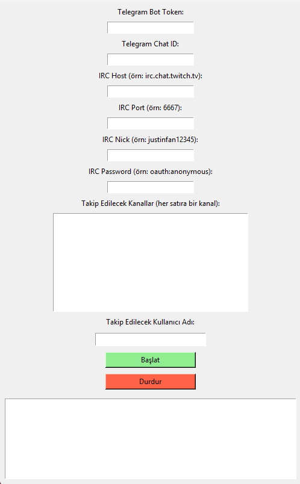

# 🎯 TrackSniper

Belirli Twitch kullanıcılarını chatler içinde takip eden ve tespit edildiğinde Telegram üzerinden anında bildirim gönderen akıllı takip botu.


---

## 🚀 Özellikler

- Twitch IRC kanallarında kullanıcı taraması yapar.
- Belirlediğiniz kullanıcıyı canlı chat içinde bulur.
- Bulunduğunda Telegram botu üzerinden anında haber verir.
- Kullanıcı dostu GUI arayüzü ile tüm ayarlar kolayca yapılır.
- Twitch streamlerinde anlık takip sağlar.
- Telegram botunuzu kullanarak güvenli bildirim gönderimi.

---

## 🛠️ Kurulum

Projeyi klonlayın:

```bash
git clone https://github.com/KULLANICI_ADIN/tracksniper.git
cd tracksniper
```

Gereken paketleri yükleyin:

```bash
pip install -r requirements.txt
```

> `tkinter` modülü Python ile birlikte gelir, ayrıca yüklemenize gerek yoktur.

---

## ⚡ Kullanım

1. `python tracksniper.py` komutu ile başlatın.
2. GUI arayüzünde:
   - **Telegram Bot Token** girin.
   - **Telegram Chat ID** girin.
   - **IRC Host**, **Port**, **Nick**, **Password** bilgilerini doldurun.
   - Takip edilecek kanalları (birer satır halinde) girin.
   - Takip etmek istediğiniz kullanıcı adını yazın.
3. **Başlat** butonuna basın.
4. Bot, kullanıcının hangi kanalda olduğunu anlık olarak bildirir.

---

## 📸 Ekran Görüntüsü



> Uygulamanın çalışma ekranı.

---

## 📦 Gereksinimler

- Python 3.8 veya üzeri
- `requests`
- `tkinter` (standart Python modülü)

---

## 📜 Notlar

- Twitch IRC üzerinden bağlantı yapılır. Bağlantı limitlerini aşmamaya dikkat edin.
- Telegram Bot Token ve Chat ID bilgilerini doğru girmeniz gerekmektedir.
- IRC host ve port bilgileri için Twitch'in public IRC servisi kullanılabilir:
  - Host: `irc.chat.twitch.tv`
  - Port: `6667`
  - Nick: `justinfanXXXXXX` (anonim nick)
  - Password: `oauth:anonymous`

---

## 📝 Lisans

Bu proje [MIT License](LICENSE) ile lisanslanmıştır.

---
